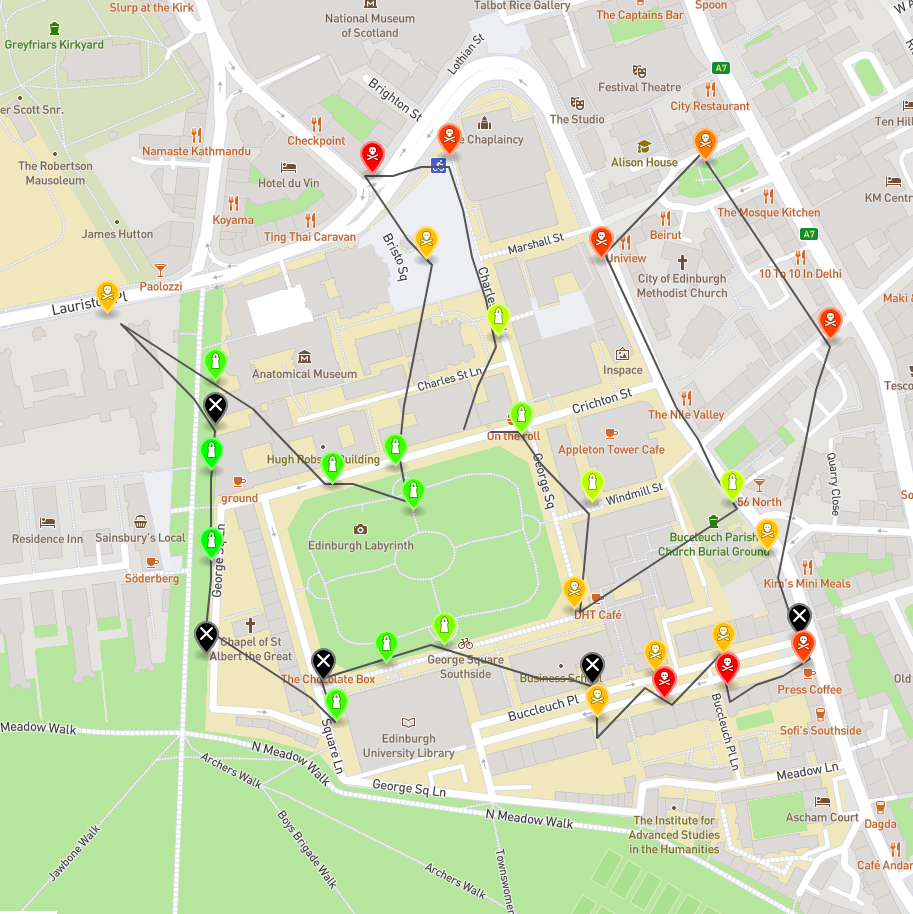

# InformaticsLargePractical
Coursework for Informatics Large Practical

For this coursework we had to design a drone which goes through some sensors, gets their readings, and comes back in less than 150 moves. Each move is worth 0.0003 degrees. Another requirement is that we can not go through any of the no-fly zones which are read through the web-server. The full specifications can be found at ilp-coursework(1).pdf . We also had to comply to software engineering practices and all of them are explained at ilp-report.pdf.
Here is an example of the path taken by the drone:

The source code for the project is in the aqmaps folder. The heatmap folder was for a small part of coursework. We used Maven for the project.

An example path for the date of 11-11-2020 is shown below:

